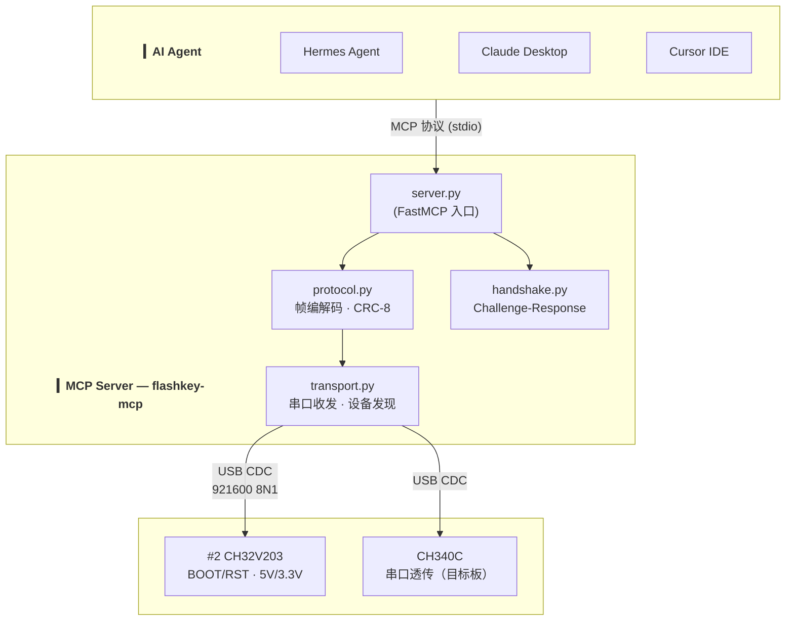
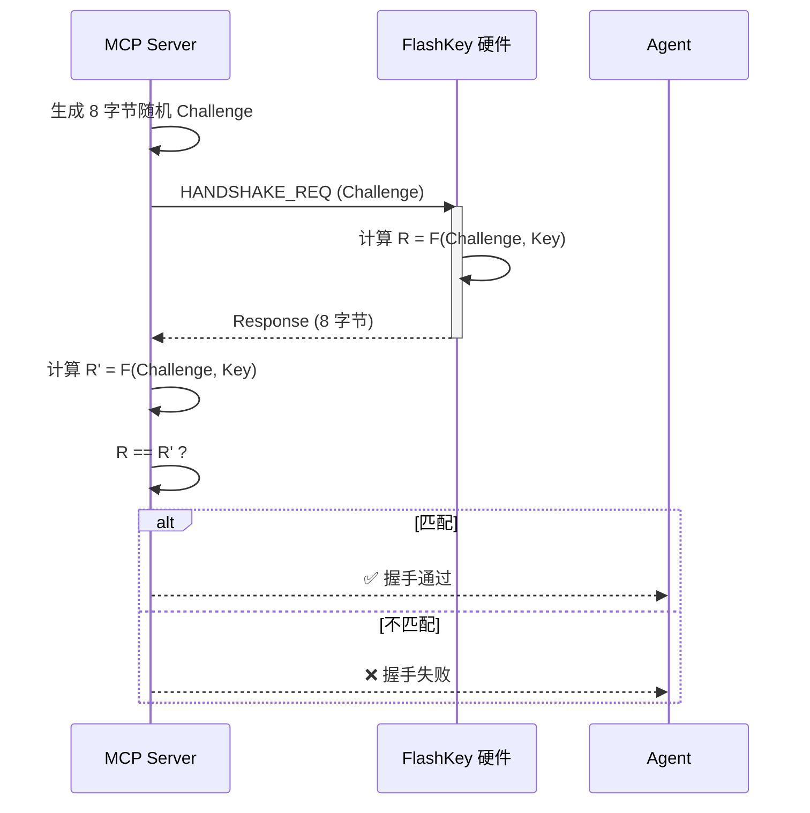
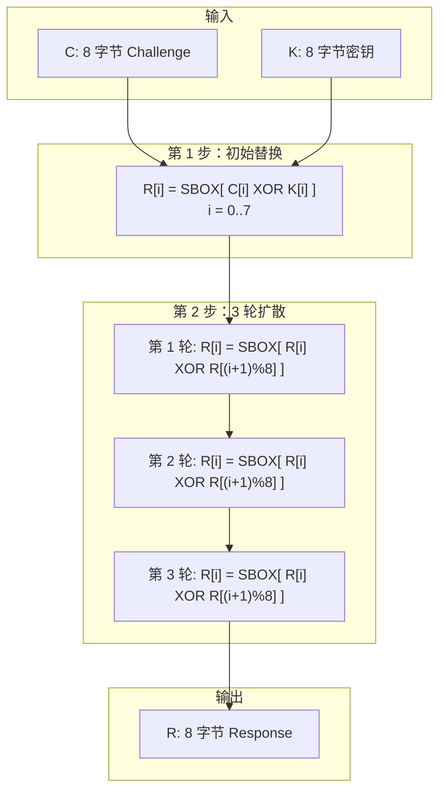

# FlashKey MCP Server — 设计文档

> 2026-06-05 · v1.0 设计稿

---

## 1. 整体架构



### 分层职责

| 层 | 文件 | 职责 |
|----|------|------|
| **协议层** | `protocol.py` | 帧结构定义、CRC-8/MAXIM 编解码、命令码/错误码枚举 |
| **传输层** | `transport.py` | 串口打开/关闭、帧收发、设备发现（扫描 VID:PID） |
| **握手层** | `handshake.py` | 8字节 Challenge-Response、SBOX + 3轮扩散算法 |
| **服务层** | `server.py` | FastMCP 入口、22 个 MCP 工具注册、全局客户端管理 |

---

## 2. 连接生命周期


**退出路径**（不会让图变乱，但必须清楚）：

| 当前状态 | 动作 | 下一状态 |
|----------|------|:--------:|
| 任意 | `flashkey_disconnect()` | DISCONNECTED |
| CONNECTED | ping 失败 | DISCONNECTED |
| PING_VERIFIED | handshake 失败 | DISCONNECTED |
| AUTHENTICATED | `flashkey_reset_device()` | CONNECTED |

**关键约束**：所有控制命令（BOOT/RST/电源）必须在 AUTHENTICATED 状态下执行。未握手调用返回 `ERR_NOT_HANDSHAKED (0xE0)`。

---

## 3. 帧协议

### 帧格式

```
SOF(0xAA) | LEN(1B) | CMD(1B) | DATA(0..248B) | CRC8(1B) | EOF(0x55)
```

- **SOF**: 帧起始 0xAA
- **LEN**: 数据载荷长度（0-248）
- **CMD**: 命令码（请求 0x01-0x30，响应 = CMD | 0x80）
- **DATA**: 载荷，最大 248 字节
- **CRC8**: CRC-8/MAXIM (poly 0x31)，覆盖 LEN+CMD+DATA
- **EOF**: 帧结束 0x55

### 命令码

| 命令 | 码值 | 方向 | 说明 |
|------|:----:|:----:|------|
| PING | 0x01 | → | 验证连通性，返回 MAGIC "FK01" |
| HANDSHAKE_REQ | 0x02 | → | 发起 Challenge-Response 认证 |
| GET_VERSION | 0x03 | → | 读取固件版本号 |
| GET_UID | 0x04 | → | 读取芯片唯一 ID |
| RESET_DEVICE | 0x06 | → | 软复位 FlashKey MCU |
| BOOT_SET | 0x10 | → | 设置 BOOT 引脚电平 |
| BOOT_GET | 0x11 | → | 读取 BOOT 引脚电平 |
| RST_SET | 0x12 | → | 设置 RST 引脚电平 |
| RST_GET | 0x13 | → | 读取 RST 引脚电平 |
| RST_PULSE | 0x14 | → | 生成 RST 脉冲（低→等待→高） |
| V5V_SET | 0x20 | → | 开关 5V 输出 |
| V5V_GET | 0x21 | → | 读取 5V 状态 |
| V3V3_SET | 0x22 | → | 开关 3.3V 输出 |
| V3V3_GET | 0x23 | → | 读取 3.3V 状态 |
| GET_ALL_STATUS | 0x30 | → | 一次性读取所有引脚+电源+握手状态 |

响应码 = 请求码 | 0x80，首个字节为状态码。

### 状态码

| 码值 | 含义 |
|:----:|------|
| 0x00 | SUCCESS |
| 0xE0 | ERR_NOT_HANDSHAKED — 未认证 |
| 0xE1 | ERR_HANDSHAKE_FAIL — 握手失败 |
| 0xE2 | 未知命令 |
| 0xE3 | 数据长度无效 |
| 0xE4 | CRC 校验失败 |
| 0xE5 | 参数无效 |
| 0xE6 | 超时 |
| 0xE7 | 设备忙 |
| 0xF0 | 5V 输出失败 |
| 0xF1 | 3.3V 输出失败 |
| 0xF2 | 过流保护 |

---

## 4. 握手算法

### 流程



### 算法 F(C, K)



SBOX 为 256 字节替代表（AES SBOX 变体），密钥 K 为 8 字节，产线烧录时写入。

---

## 5. 烧录时序（一键 enter_bootloader）

### BL618 / BL602


### ESP32


### STM32


---

## 6. 设备发现

MCP Server 扫描本地串口，匹配规则：

1. VID = 0x1A86（沁恒）
2. 排除 CH340C 的已知 PID（0x7523）
3. 剩余的就是 CH32V203 控制接口

**为什么这么设计**：FlashKey 的 USB PID 尚未向沁恒申请正式编号，先用 VID 过滤 + 排除法识别。正式 PID 下来后改为精确匹配。

---

## 7. 待决策事项

| 决策 | 选项 | 建议 |
|------|------|------|
| USB PID | 自定 vs 向沁恒申请 | 申请正式 PID |
| 设备密钥长度 | 8 字节 vs 16 字节 | 8 字节够用 |
| 密钥注入方式 | 环境变量 vs 配置文件 | 环境变量（不留盘） |
| 串口透传实现 | MCP Server 代理 vs 独立工具 | MCP Server 内置 |
| 多设备支持 | 单例 vs 设备池 | 先单例，v2 池化 |
